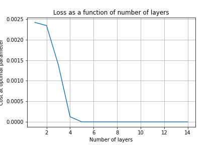

# QOSF Mentorship Application

Hello! This is my application to the [Quantum Open Source Foundation's](https://qosf.org/) mentorship program. Of the 4 tasks, I decided to do task 1 using the [Pennylane library](https://pennylane.ai/).

#### NOTE
The [task_1.html](task_1.html) file is an HTML export of Task 1.ipynb

## Problem Statement
Implement, on a quantum simulator of your choice, the following 4 qubits state $|\psi(\theta)>$:

Where the number of layers, denoted with L, has to be considered as a parameter. We call ¨Layer¨ the combination of 1 yellow + 1 green block, so, for example, U1 + U2 is a layer. The odd/even variational blocks are given by:

Even blocks:

Odd blocks:

The angles $\theta_{i,n}$ are variational parameters, lying in the interval $(0, 2\pi)$, initialized at random. Double qubit gates are CZ gates.

Report with a plot, as a function of the number of layers, L, the minimum distance

$$
\varepsilon=\min _{\theta}\||\psi(\theta)>-| \varphi>\|
$$

Where $| \varphi>$ is a randomly generated vector on 4 qubits and the norm $|| | v> ||$, of a state $| v>$, simply denotes the sum of the squares of the components of $|v >$. The right set of parameters $i,n$ can be found via any method of choice (e.g. grid-search or gradient descent)

## Solution

The code for the problem and other experiments can be found in [Task 1.ipynb](Task%201.ipynb). The required plot of loss vs. layer is:

Here, we can see that as we increase the number of layers, the loss decreases. After 8 layers, we seem to have settled on the optimal loss. This seems to be the case irrespective of the value of the vector we want to predict.
